## 🧠 Improved Mermaid Architecture Diagram

```mermaid
flowchart TD
    %% External Sources
    subgraph Sources [🔗 External Data Sources]
        GS[📁 Google Sheets]
        SNF[🧊 Snowflake]
        SLK[💬 Slack]
        SN[🪐 ServiceNow API]
        SF[🚀 Salesforce API]
        JIRA[📌 JIRA API]
    end

    %% Scheduler
    subgraph Schedule [⏱️ Auto-Refresh Every 1–2 Hours]
        CRON[🧑‍🍳 APScheduler / Celery Beat]
    end

    %% ETL and Pipeline
    CRON --> ETL[⚙️ ETL Connectors]
    Sources --> ETL

    ETL --> Normalize[📦 Normalize + Add Metadata]
    Normalize --> Chunk[🧠 Text Chunking LangChain]
    Chunk --> Embed[🧬 NeMo Embeddings]

    %% Storage
    Embed --> VStore[📂 FAISS Vectorstore]
    Embed --> MDB[(🧾 Metadata DB)]

    %% Retrieval
    VStore --> Retriever[🔁 Unified Retriever / RAG Layer]
    MDB --> Retriever
```



---

## 📖 Description of the Flow

### 🔗 **Sources**

* All systems feeding raw data: Google Sheets, Snowflake, Slack, ServiceNow, Salesforce, JIRA.

### ⏱️ **Auto-Refresh Scheduler**

* A `Celery Beat` or `APScheduler` triggers the ETL job every 1–2 hours.

### ⚙️ **ETL Connectors**

* Fetch data from each source using API or SDK.
* Sends data to the normalization stage.

### 📦 **Normalization + Metadata**

* Structures data into a uniform format.
* Adds metadata like source, timestamp, case ID, etc.

### 🧠 **Chunking**

* Breaks data into LLM-readable chunks using LangChain's text splitters.

### 🧬 **Embeddings**

* Chunks are embedded using NVIDIA NeMo models.

### 💾 **Storage**

* Embeddings stored in persistent **FAISS vectorstore**.
* Metadata stored in a **Metadata DB** (PostgreSQL or SQLite).

### 🔍 **Retriever**

* Combines both vectorstore and metadata for full RAG-based retrieval in your chatbot or RCA module.

---


**Hours in 1 month (30 days):**
30 days × 24 hours = **720 hours**

---

### Cost per OS

✅ **Windows**
0.0162 USD/hour × 720 hours = **11.664 USD/month**

✅ **Ubuntu Pro**
0.0134 USD/hour × 720 hours = **9.648 USD/month**

✅ **SUSE**
0.0116 USD/hour × 720 hours = **8.352 USD/month**

✅ **RHEL**
0.026 USD/hour × 720 hours = **18.72 USD/month**

✅ **Linux (base)**
0.0116 USD/hour × 720 hours = **8.352 USD/month**

---

### Clean table summary

| Operating System | Price per Hour (USD) | Monthly Cost (USD) |
| ---------------- | -------------------- | ------------------ |
| Windows          | 0.0162               | 11.664             |
| Ubuntu Pro       | 0.0134               | 9.648              |
| SUSE             | 0.0116               | 8.352              |
| RHEL             | 0.026                | 18.72              |
| Linux (base)     | 0.0116               | 8.352              |

---


The command `git config` is used to set and retrieve configuration options for Git repositories. Here's a breakdown of its usage:

---

### 🔧 Basic Syntax

```bash
git config [<option>] <key> <value>
```

---

### 📍 Common Options

| Option     | Description                                                                      |
| ---------- | -------------------------------------------------------------------------------- |
| `--global` | Applies the setting globally (for the current user)                              |
| `--system` | Applies the setting system-wide (admin access required)                          |
| `--local`  | Applies the setting to the current repository only (default if no flag is given) |

---

### ✨ Common Use Cases

#### 1. **Set Global User Identity**

```bash
git config --global user.name "Your Name"
git config --global user.email "you@example.com"
```

#### 2. **Check Current Configuration**

```bash
git config --list
```

Or for a specific value:

```bash
git config user.name
```

#### 3. **Set Default Editor**

```bash
git config --global core.editor "code --wait"
```

#### 4. **Enable Colored Output**

```bash
git config --global color.ui auto
```

#### 5. **Set Default Branch Name**

```bash
git config --global init.defaultBranch main
```

---

### 📁 Configuration Levels

1. **System (`/etc/gitconfig`)**

   * Use `--system`
2. **Global (`~/.gitconfig`)**

   * Use `--global`
3. **Local (`.git/config`)**

   * Repository-specific, default if no flag is given

---

Would you like help configuring something specific with Git, like authentication, aliases, or push behavior?
