## 🧠 Improved Mermaid Architecture Diagram

```mermaid
flowchart TD
    %% External Sources
    subgraph Sources [🔗 External Data Sources]
        GS[📁 Google Sheets]
        SNF[🧊 Snowflake]
        SLK[💬 Slack]
        SN[🪐 ServiceNow API]
        SF[🚀 Salesforce API]
        JIRA[📌 JIRA API]
    end

    %% Scheduler
    subgraph Schedule [⏱️ Auto-Refresh Every 1–2 Hours]
        CRON[🧑‍🍳 APScheduler / Celery Beat]
    end

    %% ETL and Pipeline
    CRON --> ETL[⚙️ ETL Connectors]
    Sources --> ETL

    ETL --> Normalize[📦 Normalize + Add Metadata]
    Normalize --> Chunk[🧠 Text Chunking LangChain]
    Chunk --> Embed[🧬 NeMo Embeddings]

    %% Storage
    Embed --> VStore[📂 FAISS Vectorstore]
    Embed --> MDB[(🧾 Metadata DB)]

    %% Retrieval
    VStore --> Retriever[🔁 Unified Retriever / RAG Layer]
    MDB --> Retriever
```



---


## 📖 Description of the Flow

### 🔗 **Sources**

* All systems feeding raw data: Google Sheets, Snowflake, Slack, ServiceNow, Salesforce, JIRA.

### ⏱️ **Auto-Refresh Scheduler**

* A `Celery Beat` or `APScheduler` triggers the ETL job every 1–2 hours.

### ⚙️ **ETL Connectors**

* Fetch data from each source using API or SDK.
* Sends data to the normalization stage.

### 📦 **Normalization + Metadata**

* Structures data into a uniform format.
* Adds metadata like source, timestamp, case ID, etc.

### 🧠 **Chunking**

* Breaks data into LLM-readable chunks using LangChain's text splitters.

### 🧬 **Embeddings**

* Chunks are embedded using NVIDIA NeMo models.

### 💾 **Storage**

* Embeddings stored in persistent **FAISS vectorstore**.
* Metadata stored in a **Metadata DB** (PostgreSQL or SQLite).

### 🔍 **Retriever**

* Combines both vectorstore and metadata for full RAG-based retrieval in your chatbot or RCA module.

---


**Hours in 1 month (30 days):**
30 days × 24 hours = **720 hours**

---

### Cost per OS

✅ **Windows**
0.0162 USD/hour × 720 hours = **11.664 USD/month**

✅ **Ubuntu Pro**
0.0134 USD/hour × 720 hours = **9.648 USD/month**

✅ **SUSE**
0.0116 USD/hour × 720 hours = **8.352 USD/month**

✅ **RHEL**
0.026 USD/hour × 720 hours = **18.72 USD/month**

✅ **Linux (base)**
0.0116 USD/hour × 720 hours = **8.352 USD/month**

---

### Clean table summary

| Operating System | Price per Hour (USD) | Monthly Cost (USD) |
| ---------------- | -------------------- | ------------------ |
| Windows          | 0.0162               | 11.664             |
| Ubuntu Pro       | 0.0134               | 9.648              |
| SUSE             | 0.0116               | 8.352              |
| RHEL             | 0.026                | 18.72              |
| Linux (base)     | 0.0116               | 8.352              |

---


The command `git config` is used to set and retrieve configuration options for Git repositories. Here's a breakdown of its usage:

---

### 🔧 Basic Syntax

```bash
git config [<option>] <key> <value>
```

---

### 📍 Common Options

| Option     | Description                                                                      |
| ---------- | -------------------------------------------------------------------------------- |
| `--global` | Applies the setting globally (for the current user)                              |
| `--system` | Applies the setting system-wide (admin access required)                          |
| `--local`  | Applies the setting to the current repository only (default if no flag is given) |

---

### ✨ Common Use Cases

#### 1. **Set Global User Identity**

```bash
git config --global user.name "Your Name"
git config --global user.email "you@example.com"
```

#### 2. **Check Current Configuration**

```bash
git config --list
```

Or for a specific value:

```bash
git config user.name
```

#### 3. **Set Default Editor**

```bash
git config --global core.editor "code --wait"
```

#### 4. **Enable Colored Output**

```bash
git config --global color.ui auto
```

#### 5. **Set Default Branch Name**

```bash
git config --global init.defaultBranch main
```

---

### 📁 Configuration Levels

1. **System (`/etc/gitconfig`)**

   * Use `--system`
2. **Global (`~/.gitconfig`)**

   * Use `--global`
3. **Local (`.git/config`)**

   * Repository-specific, default if no flag is given

---


The order management flow for Unnwrap integrates Shopify, Cherrio, and Pabbly to streamline both gifting and self-purchase scenarios. When a user places an order on the Shopify website and completes payment via Razorpay, the system triggers a webhook to Cherrio. Cherrio generates a unique voucher code for every order, ensuring accurate tracking and vendor referencing.

Depending on the order type, the workflow branches into two paths. For gift purchases, the user fills a gift form, and Cherrio triggers its gift flow—sending WhatsApp and email notifications to the recipient and vendor. For self-purchases, Cherrio’s self flow ensures both the buyer and vendor receive automated updates. In both cases, Pabbly synchronizes the order details with Google Sheets, enabling backend teams to track, analyze, and maintain records efficiently.

Additionally, vendors can use the generated voucher code to track orders, while Cherrio simultaneously integrates with global analytics to monitor communication performance. This architecture ensures seamless automation, timely notifications, and centralized order tracking—keeping buyers, vendors, and backend operations aligned without manual intervention.


The vendor onboarding process starts with the Unnwrap team adding vendor details in the Master Google Sheet and marking them with a “Vendor” tag.
The sheet is then exported as a CSV and imported into Cherrio, where vendors are tagged to prevent automated WhatsApp/Email messages.
In Pabbly, a new Router is created with product name–based conditions to manage vendor-specific workflows.
This setup ensures vendors are onboarded smoothly without triggering customer-facing messages.
The process centralizes data, prevents miscommunication, and keeps vendor automation organized across tools.


Would you like help configuring something specific with Git, like authentication, aliases, or push behavior?
